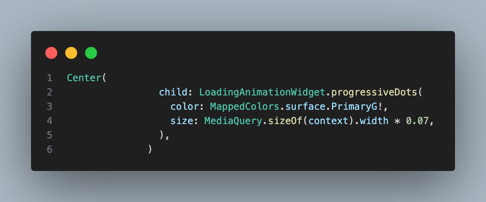

<!--
This README describes the package. If you publish this package to pub.dev,
this README's contents appear on the landing page for your package.

For information about how to write a good package README, see the guide for
[writing package pages](https://dart.dev/tools/pub/writing-package-pages).

For general information about developing packages, see the Dart guide for
[creating packages](https://dart.dev/guides/libraries/create-packages)
and the Flutter guide for
[developing packages and plugins](https://flutter.dev/to/develop-packages).
-->

# design_system_360

A Flutter design system package to streamline the UI development process with reusable components, custom themes, and accessible design patterns.

## Features

- Predefined themes (light)
- Custom typography and color schemes
- Reusable widgets like buttons, cards, etc.

## Getting started

Add the following line to your `pubspec.yaml` file:
```yaml
dependencies:
  design_system_360: ^1.0.0
```

## Usage

import 'package:design_system_360/design_system_360.dart';

void main() {
  runApp(MaterialApp(
    theme: AppTheme.lightTheme,
    home: Scaffold(
      appBar: AppBar(title: const Text('Design System Example')),
      body: Center(
        child: AppButton(
          label: 'Click Me',
          onPressed: () => print('Button Pressed'),
        ),
      ),
    ),
  ));
}



## Additional information

we want to improve it day by day
